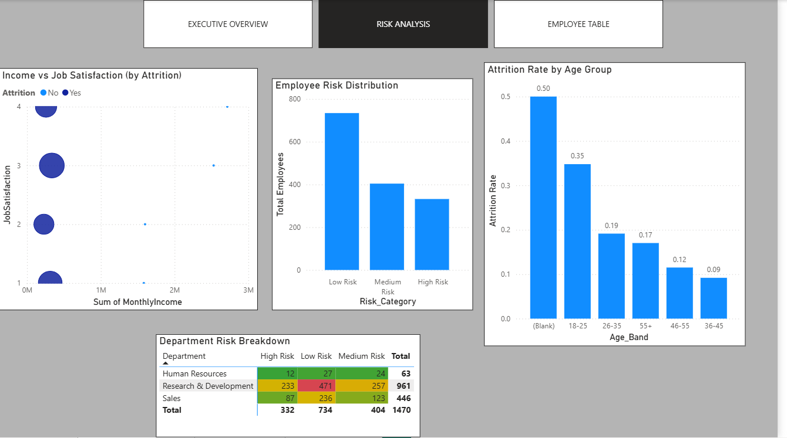
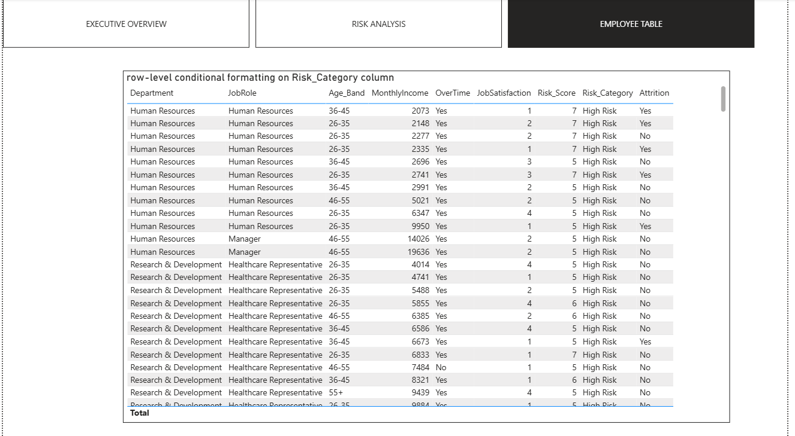

# HR-Attrition-Analytics-Project

> Predicting and analysing employee attrition using the IBM HR Analytics dataset — with EDA, visualisations, and a Logistic Regression classifier.

---

## 🔍 Problem Statement
Employee attrition costs companies significantly in recruitment and training. This project identifies **who is likely to leave and why** — giving HR teams data to act before it's too late.

---

## 📁 Dataset
- **Source**: [IBM HR Analytics — Kaggle](https://www.kaggle.com/datasets/pavansubhasht/ibm-hr-analytics-attrition-dataset)
- **Size**: 1,470 employees × 35 features
- **Target**: `Attrition` (Yes / No)

---

## 📊 Key Findings

| Insight | Finding |
|---------|---------|
| Overall Attrition Rate | **16.1%** (above 10% industry benchmark) |
| Highest Risk Role | Sales Representative |
| Overtime Impact | Employees on overtime attrite **3x more** |
| Income Effect | Bottom-25% earners have highest attrition |
| Department Risk | Sales > HR > R&D |

---

## 🤖 Machine Learning Model

| Metric | Score |
|--------|-------|
| Algorithm | Logistic Regression |
| Train/Test Split | 80/20 (stratified) |
| Accuracy | ~88% |
| Key Features | OverTime, MonthlyIncome, Age, JobSatisfaction |

---

## 📈 Visualisations Generated

| File | Description |
|------|-------------|
| `01_attrition_overview.png` | Attrition split + department breakdown |
| `02_attrition_drivers.png` | Age, income, overtime, job satisfaction |
| `03_correlation.png` | Feature correlation with attrition |
| `04_jobrole_attrition.png` | Attrition rate by job role |
| `05_confusion_matrix.png` | Model evaluation |
| `06_feature_importance.png` | Logistic regression coefficients |

---

## 🛠️ Tech Stack
`Python` · `Pandas` · `NumPy` · `Matplotlib` · `Seaborn` · `Scikit-learn`

---

## 💡 Business Recommendations
1. Review overtime policies — excessive overtime is the #1 controllable attrition driver
2. Introduce retention bonuses for bottom-quartile income earners
3. Focus exit interview programs on Sales Representatives
4. Implement job satisfaction surveys quarterly (score < 2 = high risk)
5. Reduce commute burden through hybrid work for Distance > 15km employees

---## 📸 Dashboard Preview

### Executive Overview

### Risk Analysis

### Employee Table

